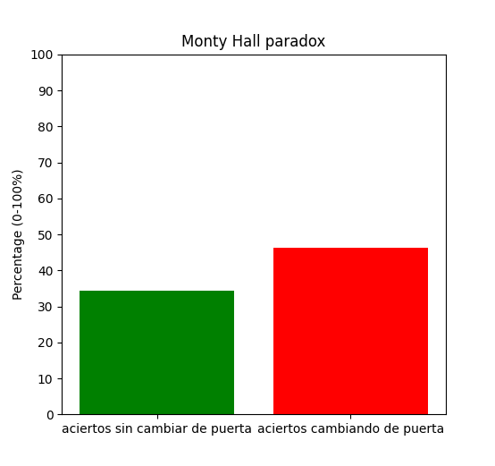

# The Monty Hall Paradox

A simulation illustrating the [Monty Hall paradox](https://en.wikipedia.org/wiki/Monty_Hall_problem).

The simulation conterunituitively demonstrates that you get an extra third of probabilities of getting the prize by changing your initial choice.
